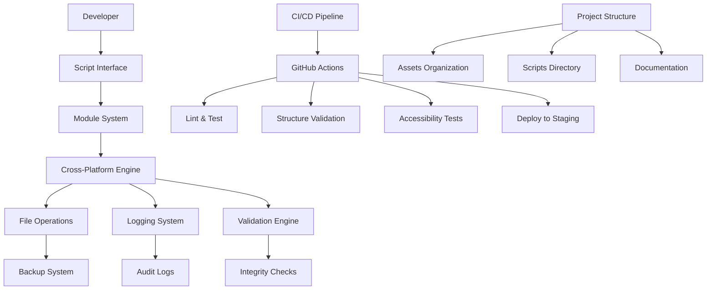

# Documento de Design: Modernização da Infraestrutura do Projeto

## Visão Geral

Este design delineia a arquitetura técnica e abordagem de implementação para modernizar a infraestrutura do projeto A-Cifra. A solução foca em criar um ambiente de desenvolvimento robusto, escalável e sustentável através de scripts modulares, fluxos de trabalho automatizados e organização profissional do projeto.

## Arquitetura

### Arquitetura de Alto Nível



### Core Components

1. **Modular Script System**: PowerShell modules (.psm1) with exported functions
2. **Cross-Platform Engine**: Node.js/TypeScript alternatives for critical operations
3. **CI/CD Pipeline**: GitHub Actions workflows for automation
4. **Project Structure Manager**: Organized directory hierarchy with naming conventions
5. **Documentation Generator**: Automated documentation with standards compliance
6. **Safety Layer**: Backup, validation, and rollback mechanisms

## Components and Interfaces

### 1. Script Module System

#### PowerShell Module Structure
```powershell
# ProjectReorganizer.psm1
function Write-AuditLog { }
function Confirm-Action { }
function Create-Backup { }
function Move-UsedImages { }
function Validate-FileIntegrity { }
function Generate-Report { }
Export-ModuleMember -Function *
```

#### Node.js Alternative Structure
```typescript
// src/scripts/project-reorganizer.ts
export class ProjectReorganizer {
  async writeAuditLog(message: string): Promise<void>
  async confirmAction(message: string): Promise<boolean>
  async createBackup(sourcePath: string): Promise<string>
  async moveUsedImages(dryRun: boolean): Promise<void>
  async validateFileIntegrity(filePath: string): Promise<boolean>
  async generateReport(): Promise<string>
}
```

### 2. Configuration Management

#### Script Configuration
```json
{
  "logging": {
    "enabled": true,
    "level": "info",
    "outputPath": "./logs/operations.log"
  },
  "backup": {
    "enabled": true,
    "retentionDays": 30,
    "compressionEnabled": true
  },
  "validation": {
    "checksumAlgorithm": "sha256",
    "verifyBeforeOperation": true,
    "verifyAfterOperation": true
  },
  "dryRun": {
    "defaultMode": false,
    "confirmationRequired": true
  }
}
```

### 3. Project Structure Organization

#### New Directory Structure
```
A-Cifra-main/
├── scripts/                    # All automation scripts
│   ├── modules/               # PowerShell modules
│   │   ├── ProjectReorganizer.psm1
│   │   ├── ImageOptimizer.psm1
│   │   └── DocumentationGenerator.psm1
│   ├── node/                  # Node.js alternatives
│   │   ├── project-reorganizer.ts
│   │   ├── image-optimizer.ts
│   │   └── documentation-generator.ts
│   ├── config/                # Configuration files
│   │   └── scripts-config.json
│   └── main/                  # Main execution scripts
│       ├── reorganize-project.ps1
│       └── reorganize-project.js
├── public/
│   └── images/
│       ├── articles/          # Article-specific images
│       ├── brand/             # Brand assets with versioning
│       │   ├── v1/
│       │   └── v2/
│       ├── icons/             # UI icons and favicons
│       └── logos/             # Logo variations
├── docs/
│   ├── scripts/               # Script documentation
│   ├── guides/                # User guides with screenshots
│   └── api/                   # Generated API documentation
├── .github/
│   └── workflows/
│       ├── ci.yml
│       ├── accessibility.yml
│       └── deploy.yml
└── logs/                      # Operation logs (gitignored)
    ├── operations.log
    └── backups/
```

### 4. CI/CD Pipeline Design

#### GitHub Actions Workflow Structure
```yaml
# .github/workflows/ci.yml
name: Continuous Integration
on: [push, pull_request]

jobs:
  lint-scripts:
    runs-on: ubuntu-latest
    steps:
      - name: Lint PowerShell Scripts
      - name: Lint TypeScript Scripts
      - name: Validate Script Configuration

  test-structure:
    runs-on: ubuntu-latest
    steps:
      - name: Validate Project Structure
      - name: Check File Naming Conventions
      - name: Verify Asset Organization

  accessibility-tests:
    runs-on: ubuntu-latest
    steps:
      - name: Build Application
      - name: Run Pa11y Accessibility Tests
      - name: Generate Accessibility Report

  deploy-staging:
    needs: [lint-scripts, test-structure, accessibility-tests]
    runs-on: ubuntu-latest
    if: github.ref == 'refs/heads/main'
    steps:
      - name: Deploy to Staging Environment
      - name: Run Smoke Tests
      - name: Notify Team
```

## Data Models

### 1. Operation Log Entry
```typescript
interface OperationLogEntry {
  timestamp: Date;
  operation: string;
  source: string;
  destination?: string;
  status: 'started' | 'completed' | 'failed' | 'rolled_back';
  checksum?: string;
  dryRun: boolean;
  details: string;
  userId?: string;
}
```

### 2. File Integrity Record
```typescript
interface FileIntegrityRecord {
  filePath: string;
  checksum: string;
  algorithm: 'md5' | 'sha1' | 'sha256';
  size: number;
  lastModified: Date;
  verified: boolean;
}
```

### 3. Project Structure Validation
```typescript
interface StructureValidationResult {
  isValid: boolean;
  violations: StructureViolation[];
  suggestions: string[];
  score: number; // 0-100
}

interface StructureViolation {
  type: 'naming' | 'location' | 'missing' | 'unexpected';
  path: string;
  expected: string;
  actual: string;
  severity: 'error' | 'warning' | 'info';
}
```

### 4. Script Configuration Schema
```typescript
interface ScriptConfiguration {
  logging: LoggingConfig;
  backup: BackupConfig;
  validation: ValidationConfig;
  dryRun: DryRunConfig;
  notifications: NotificationConfig;
}

interface LoggingConfig {
  enabled: boolean;
  level: 'debug' | 'info' | 'warn' | 'error';
  outputPath: string;
  maxFileSize: string;
  retentionDays: number;
}
```

## Error Handling

### 1. Graceful Degradation Strategy
- **PowerShell Unavailable**: Fall back to Node.js implementations
- **Network Issues**: Use cached data and retry with exponential backoff
- **File System Errors**: Create detailed logs and suggest manual intervention
- **Permission Issues**: Provide clear instructions for resolution

### 2. Error Recovery Mechanisms
```typescript
class ErrorRecovery {
  async handleFileOperationError(error: FileSystemError): Promise<void> {
    // Log error details
    // Attempt automatic recovery
    // Create backup if possible
    // Notify user with actionable steps
  }

  async rollbackOperation(operationId: string): Promise<boolean> {
    // Restore from backup
    // Revert file system changes
    // Update audit log
    // Verify integrity
  }
}
```

### 3. Validation and Safety Checks
- **Pre-operation validation**: Verify source files exist and are accessible
- **Integrity checks**: Compare checksums before and after operations
- **Backup verification**: Ensure backups are complete and restorable
- **Rollback testing**: Verify rollback procedures work correctly

## Testing Strategy

### 1. Unit Testing
- **PowerShell Modules**: Use Pester framework for PowerShell function testing
- **Node.js Scripts**: Use Jest for TypeScript/JavaScript testing
- **Configuration Validation**: Test all configuration scenarios
- **Error Handling**: Test failure modes and recovery mechanisms

### 2. Integration Testing
- **Cross-Platform Compatibility**: Test on Windows, WSL, and Linux
- **File System Operations**: Test with various file types and sizes
- **CI/CD Pipeline**: Test complete workflow from commit to deployment
- **Backup and Recovery**: Test full backup/restore cycles

### 3. End-to-End Testing
- **Complete Reorganization**: Test full project reorganization workflow
- **Documentation Generation**: Verify all documentation is generated correctly
- **Accessibility Compliance**: Automated testing with axe-core and pa11y
- **Performance Impact**: Measure script execution times and resource usage

### 4. Safety Testing
- **Dry-Run Accuracy**: Verify dry-run mode matches actual operations
- **Backup Integrity**: Test backup creation and restoration
- **Rollback Functionality**: Test operation rollback under various conditions
- **Data Loss Prevention**: Verify no data is lost during operations

## Implementation Phases

### Phase 1: Core Infrastructure (Week 1-2)
1. Create modular PowerShell script structure
2. Implement logging and audit system
3. Add dry-run mode and confirmation prompts
4. Create basic backup functionality

### Phase 2: Cross-Platform Support (Week 2-3)
1. Develop Node.js alternatives for critical functions
2. Implement platform detection and selection
3. Create unified configuration system
4. Add cross-platform file path handling

### Phase 3: Project Structure (Week 3-4)
1. Reorganize existing project structure
2. Implement file naming conventions
3. Create asset organization system
4. Add structure validation tools

### Phase 4: CI/CD Pipeline (Week 4-5)
1. Create GitHub Actions workflows
2. Implement automated testing
3. Add accessibility testing integration
4. Set up staging deployment

### Phase 5: Documentation & Polish (Week 5-6)
1. Generate comprehensive documentation
2. Add visual guides and screenshots
3. Create maintenance procedures
4. Implement monitoring and reporting

## Security Considerations

### 1. Script Security
- **Code Signing**: Sign PowerShell scripts for execution policy compliance
- **Input Validation**: Sanitize all user inputs and file paths
- **Privilege Management**: Run with minimum required permissions
- **Secure Logging**: Avoid logging sensitive information

### 2. File System Security
- **Path Traversal Prevention**: Validate all file paths to prevent directory traversal
- **Backup Encryption**: Encrypt sensitive backups
- **Access Control**: Respect existing file permissions
- **Audit Trail**: Maintain complete audit trail of all operations

### 3. CI/CD Security
- **Secret Management**: Use GitHub Secrets for sensitive configuration
- **Branch Protection**: Require reviews for main branch changes
- **Dependency Scanning**: Scan for vulnerable dependencies
- **Environment Isolation**: Isolate staging and production environments

## Performance Optimization

### 1. Script Performance
- **Parallel Processing**: Use parallel execution for independent operations
- **Caching**: Cache file system queries and validation results
- **Incremental Operations**: Only process changed files when possible
- **Resource Management**: Monitor and limit resource usage

### 2. CI/CD Performance
- **Workflow Optimization**: Run jobs in parallel where possible
- **Caching Strategy**: Cache dependencies and build artifacts
- **Conditional Execution**: Skip unnecessary steps based on changes
- **Resource Allocation**: Use appropriate runner sizes for different jobs

This design provides a comprehensive foundation for implementing the project infrastructure modernization while maintaining safety, reliability, and scalability.